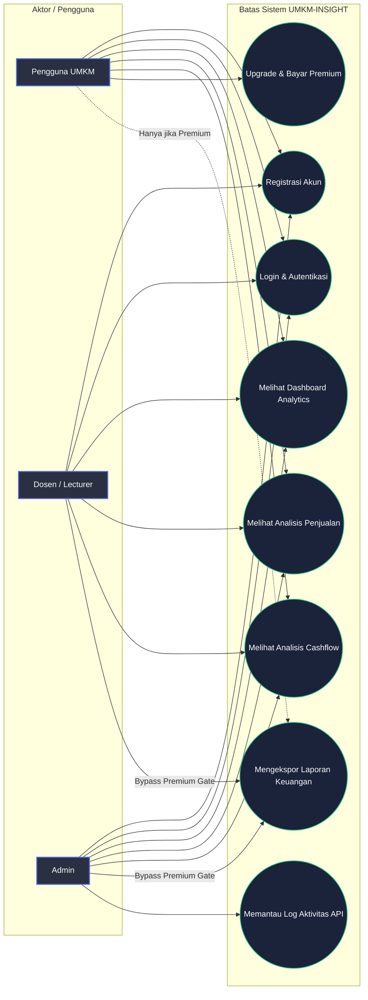
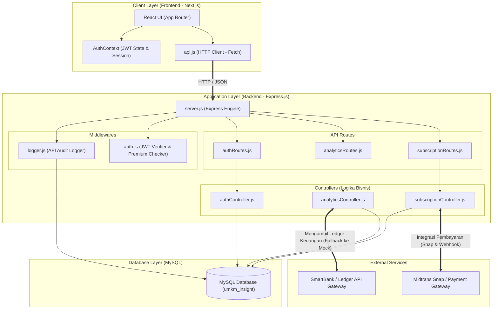
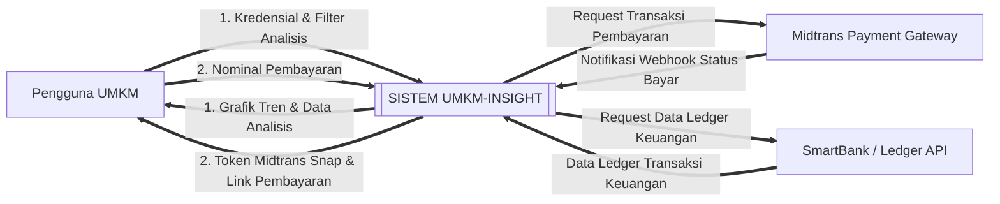
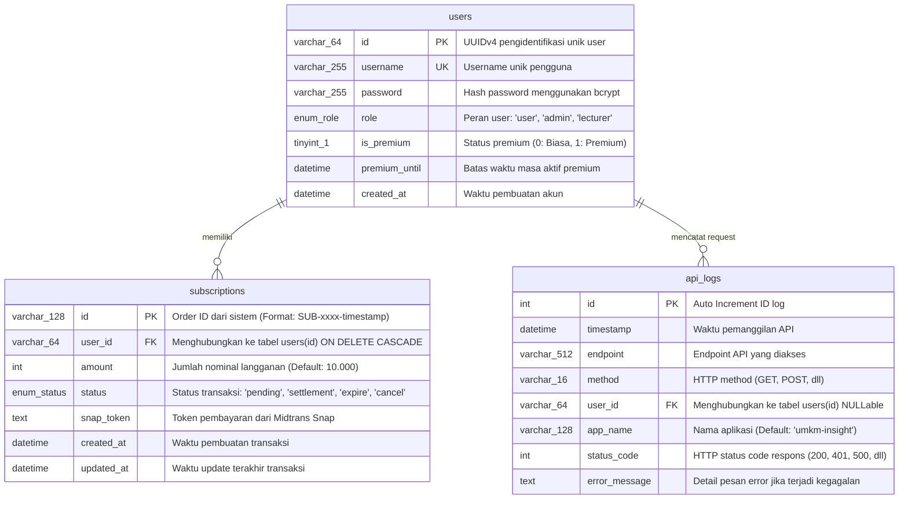
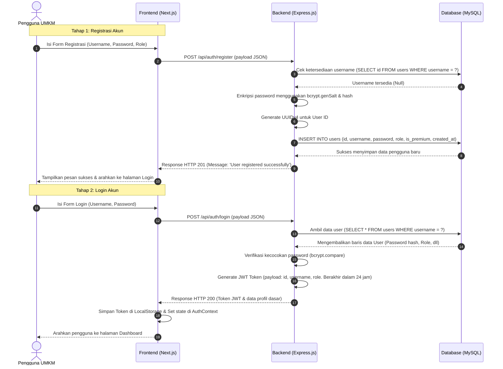
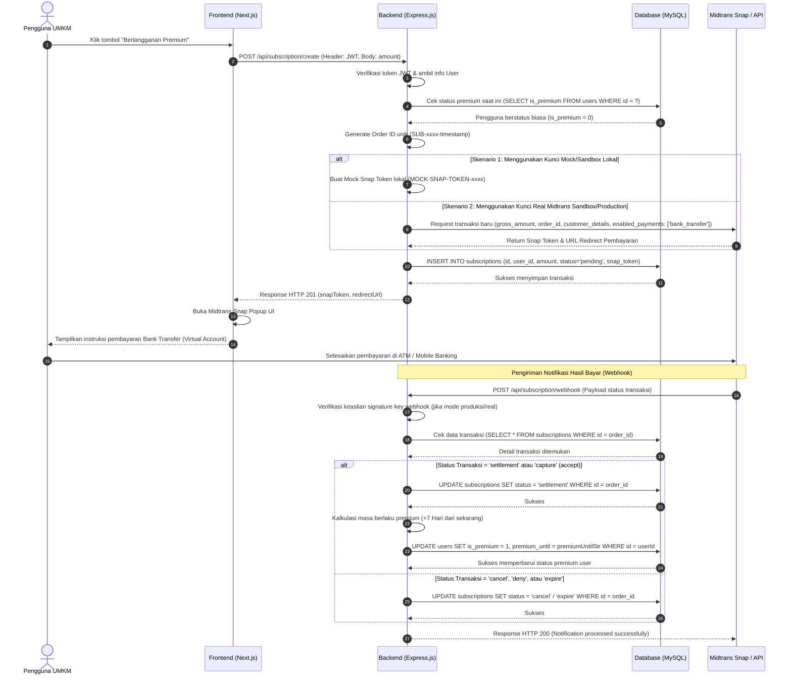
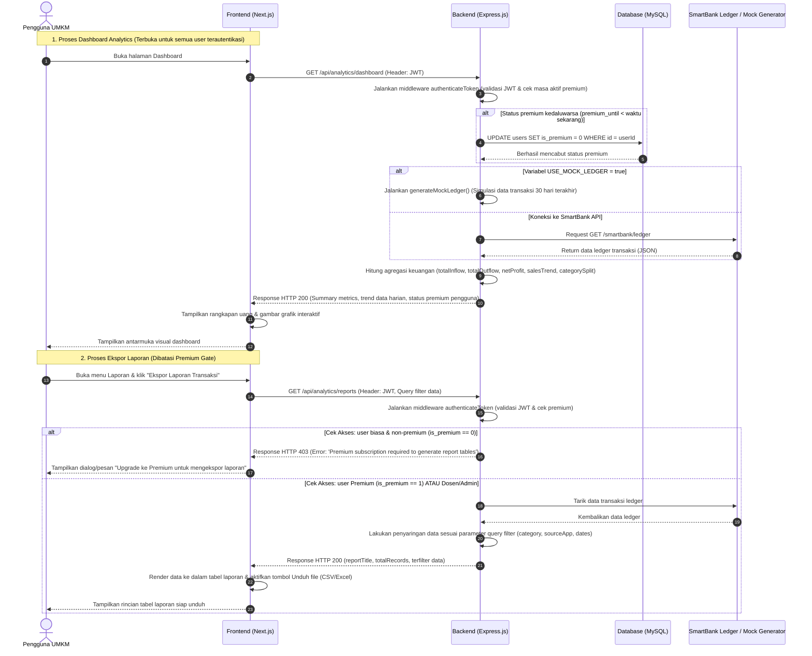

# DOKUMENTASI SRS (SOFTWARE REQUIREMENTS SPECIFICATION) - UMKM-INSIGHT

Dokumen ini berisi spesifikasi kebutuhan perangkat lunak (SRS) untuk aplikasi **UMKM-INSIGHT** yang disesuaikan berdasarkan analisis struktur folder, kode sumber backend (API Express.js), dan frontend (Next.js App Router).

---

## 1. PENDAHULUAN & DESKRIPSI SISTEM

**UMKM-INSIGHT** adalah aplikasi *full-stack* yang dirancang untuk membantu pelaku Usaha Mikro, Kecil, dan Menengah (UMKM) dalam mengelola keuangan usaha mereka. Sistem ini mengintegrasikan data transaksi dari sistem POS (Point of Sales) dan Marketplace untuk menghasilkan analisis performa bisnis secara *real-time*.

### Fitur Utama Sistem:
1. **Autentikasi & Keanggotaan Multi-Role**: Sistem mendukung registrasi dan login untuk peran *User (Pelaku UMKM)*, *Lecturer (Dosen)*, dan *Admin*.
2. **Dashboard Analytics**: Visualisasi ringkasan performa finansial seperti total pemasukan (*inflow*), total pengeluaran (*outflow*), biaya platform, pajak, laba bersih, tren penjualan harian, serta kontribusi kategori penjualan.
3. **Analisis Detail**: Halaman khusus untuk menganalisis Penjualan (*Sales*) dan Arus Kas (*Cashflow*) dengan penyaringan data (*filtering*) berbasis tanggal, kategori, dan identitas UMKM.
4. **Manajemen Berlangganan Premium (Subscription)**: Peningkatan akun menjadi Premium melalui integrasi payment gateway **Midtrans** (menggunakan metode Bank Transfer/Virtual Account) dengan masa aktif berkala (mingguan/7 hari).
5. **Ekspor Laporan Keuangan**: Fitur premium yang memungkinkan pengguna mengekspor rincian laporan keuangan (diuji melalui pembatasan akses premium/premium gate). Dosen dan Admin mendapatkan akses gratis ke fitur premium ini tanpa perlu membayar.
6. **Audit Logging (API Logger)**: Pencatatan otomatis setiap request API ke dalam database untuk keperluan monitoring performa dan auditing keamanan.

---

## 2. AKTOR SISTEM (SYSTEM ACTORS)

Sistem mengidentifikasi tiga aktor utama yang berinteraksi dengan aplikasi:

| Aktor | Deskripsi | Hak Akses Fitur |
|---|---|---|
| **Pengguna UMKM (User)** | Pelaku usaha UMKM yang menggunakan aplikasi untuk mencatat dan memantau bisnis. | Registrasi, Login, Dashboard, Analisis Sales & Cashflow, Upgrade Premium (berbayar via Midtrans). |
| **Dosen (Lecturer)** | Pengguna akademis yang melakukan review atau pengajaran. | Login, Dashboard, Analisis Sales & Cashflow, **Akses Laporan Premium gratis** (tidak perlu transaksi pembayaran). |
| **Admin** | Pengelola sistem utama. | Semua akses fitur Dosen/User, ditambah kemampuan memantau log aktivitas sistem melalui database log API. |

---

## 3. DIAGRAM KASUS PENGGUNA (USE CASE DIAGRAM)

Diagram berikut menggambarkan interaksi antara aktor (Pengguna UMKM, Dosen, Admin) dengan fungsi-fungsi utama di dalam sistem.



---

## 4. ARSITEKTUR & KOMPONEN SISTEM (SYSTEM ARCHITECTURE)

Aplikasi dibangun menggunakan arsitektur **3-Tier/Client-Server** dengan pembagian modul sebagai berikut:



---

## 5. DIAGRAM ALIRAN DATA (DATA FLOW DIAGRAM - DFD)

### DFD Level 0 (Diagram Konteks)
Diagram Konteks ini menunjukkan batasan sistem UMKM-INSIGHT dan entitas luar yang berinteraksi langsung dengannya.



### DFD Level 1 (Proses Internal)
DFD Level 1 merincikan proses bisnis utama di dalam sistem, aliran data ke database, dan keterhubungannya dengan pengguna.

```mermaid
graph TD
    %% Entitas Luar
    User[Pengguna / Aktor]
    Midtrans[Midtrans Payment Gateway]
    SmartBank[SmartBank Ledger API]

    %% Data Store
    DS_Users[(Store: users)]
    DS_Subs[(Store: subscriptions)]
    DS_Logs[(Store: api_logs)]

    %% Proses-Proses
    P1["1.0 Autentikasi & Registrasi (authController)"]
    P2["2.0 Pengolahan Analytics (analyticsController)"]
    P3["3.0 Pengelolaan Langganan (subscriptionController)"]
    P4["4.0 Log Aktivitas API (loggerMiddleware)"]

    %% Aliran Data
    User -->|Kredensial login/daftar| P1
    P1 -->|Cek/Simpan User| DS_Users
    P1 -->|Kirim Token JWT & Profil| User

    User -->|Akses Dashboard/Filter| P2
    P2 -->|Verifikasi Token & Premium| DS_Users
    P2 -->|Ambil Data Ledger| SmartBank
    SmartBank -->|Detail Transaksi (Inflow/Outflow)| P2
    P2 -->|Data Analytics & Laporan| User

    User -->|Bayar Premium (Nominal)| P3
    P3 -->|Request Token Pembayaran| Midtrans
    Midtrans -->|Token Snap & URL| P3
    P3 -->|Simpan status pending| DS_Subs
    P3 -->|Token & URL Pembayaran| User

    Midtrans -->|Notifikasi Webhook Status (settlement)| P3
    P3 -->|Update status transaksi| DS_Subs
    P3 -->|Update is_premium & premium_until| DS_Users

    %% Logging
    P1 & P2 & P3 -->|Data Request & Response| P4
    P4 -->|Simpan Audit Log| DS_Logs
```

---

## 6. ENTITY-RELATIONSHIP DIAGRAM (ERD)

Database menggunakan struktur relasional dengan tiga tabel utama: `users` (pengguna), `subscriptions` (langganan pembayaran), dan `api_logs` (log audit API).



---

## 7. DIAGRAM SEKUENSIAL (SEQUENCE DIAGRAMS)

### A. Alur Registrasi & Login Akun
Menunjukkan interaksi frontend dan backend dalam mengelola pembuatan akun dan otorisasi sesi menggunakan token JWT.



### B. Alur Pembayaran Langganan Premium (Integrasi Midtrans)
Menunjukkan siklus transaksi mulai dari pembuatan pesanan, interaksi dengan Snap API Midtrans, hingga sinkronisasi status premium melalui Webhook.



### C. Alur Analytics & Proteksi Premium Gate (Ekspor Laporan)
Menunjukkan bagaimana backend mengambil data keuangan dari SmartBank API, menghitung indikator keuangan, serta membatasi pembuatan laporan berdasarkan status premium.



---

## 8. DIAGRAM STATUS TRANSAKSI & MASA AKTIF PREMIUM (STATE DIAGRAM)

Diagram status di bawah ini menggambarkan perubahan status pembayaran langganan di tabel `subscriptions` dan hubungannya dengan status premium akun pengguna (`users.is_premium`).

```mermaid
stateDiagram-v2
    [*] --> Pending : Pengguna menekan tombol berlangganan premium & Order ID terbuat
    
    state Pembayaran_Di_Midtrans {
        Pending --> Settlement : Pembayaran sukses diselesaikan (settlement / capture)
        Pending --> Cancel : Pembayaran dibatalkan oleh pengguna (cancel / deny)
        Pending --> Expire : Batas waktu pembayaran habis (expire)
    }

    state Dampak_Ke_Pengguna {
        Settlement --> Premium_Aktif : Memicu is_premium = 1 & premium_until = NOW + 7 Hari
        Cancel --> Non_Premium : is_premium tetap 0
        Expire --> Non_Premium : is_premium tetap 0
    end

    Premium_Aktif --> Non_Premium : Masa aktif habis (waktu saat ini > premium_until) / Auto Revoke di Middleware
    Non_Premium --> [*]
```

---
*Dokumen Spesifikasi Kebutuhan Perangkat Lunak (SRS) ini dibuat dan disinkronkan secara presisi berdasarkan basis kode aktif dari proyek UMKM-INSIGHT.*
